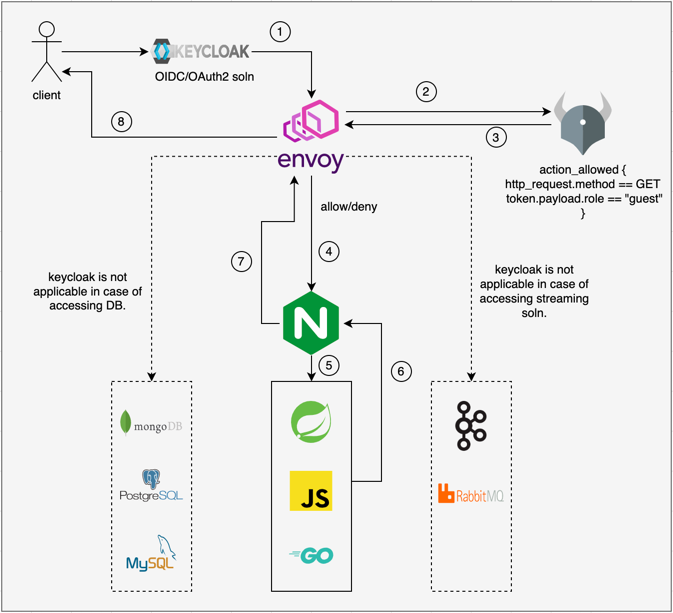

# API Security | General Purpose Authentication/Authorization using Envoy, OPA and Nginx


`This blog focus on implementing policy based security using Envoy, OPA and Nginx. 
The solution is framework-agnostic and have no dependency on programming language of API`  


## Why Envoy Proxy, OPA and Nginx?
**Envoy** is an edge-proxy service that receive request from client and delegate it to OPA for authentication and authorization.

**OPA** (Open Policy Agent)* is an open-source general purpose policy engine, that offload authentication and authorization mechanism from actual API.

**Nginx** is a lightweight reverse proxy client for any API that supports features like SSL termination, hot reloading and static content caching. Can support 50000 concurrent connections.

## Overview


## Implementation
 
### Policy for OPA in Rego language.

<script src="https://gist.github.com/rajat965ng/8252449cff12444f86de695d370192aa.js"></script>

### Envoy configuration to orchestrate between OPA and Upstream service (Nginx proxy)

<script src="https://gist.github.com/rajat965ng/7ce6627ecfcd5197351f0a1c951a4f82.js"></script>

### Docker compose file to bring in Envoy, OPA and Nginx


## Testing
### Bootstrap everything
- ```docker-compose up```

### Envoy is exposed on port 8000
- ```curl -v -X GET http://localhost:8000```


## Conclusion
This is a simple tutorial to showcase how one can protect API endpoints/microservices using Envoy and OPA. 
I'll work on the extension of the diagram mentioned above and share the integrations with Keycloak/Databases or Streaming platforms like Kafka.
Till then cheers !!

## References
- https://github.com/rajat965ng/envoy-opa-nginx-triad